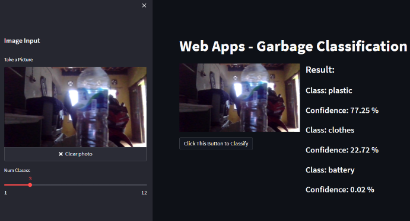

# Garbage Classification using Pytorch



### Build Image on Docker

```
$ docker build -t garbage-classification:latest .
```

### Pull Image from Dockerhub

```
$ docker pull garbage-classification:latest
```

### Run Image

```
$ docker run -it --rm -p 9000:8501 garbage-classification:latest
```
